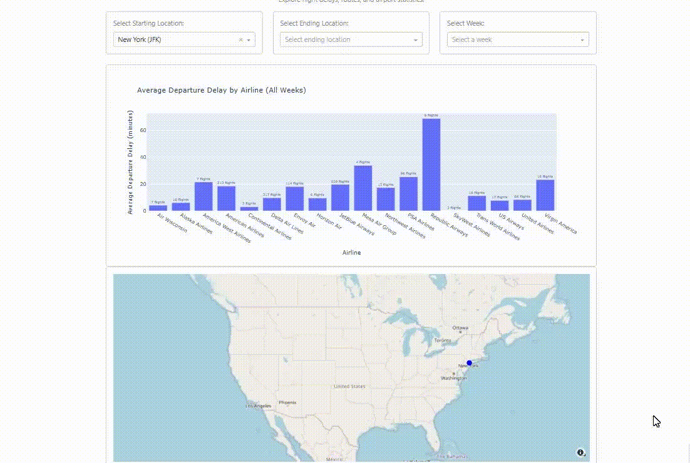

# FlightDelayAnalysis


## Example



## Description

This project is a web application that provides an interactive dashboard for analyzing flight delay data. The application allows users to visualize and explore flight delay patterns, trends, and correlations using various data visualization techniques. It utilizes Flask as the backend framework and MongoDB as the database for storing flight delay data.


## Features

- Interactive dashboard for visualizing flight delay data
- Data filtering and selection options


## Technologies Used

- Python
- Flask
- MongoDB
- Pandas
- NumPy
- Matplotlib


## Installation

1. Clone the repository:
   ```bash
   git clone https://www.github.com/Gwen1987/FlightDelayAnalysis.git
   ```
2. Navigate to the project directory:
   ```bash
    cd FlightDelayAnalysis/FlightTracker
    ```

3. Install the required dependencies:
    ```bash
    pip install -r requirements.txt
    ```

4. Set up the MongoDB database and import the flight delay data into the database. You can use the provided `import_data.py` script to import the data. Make sure to update the MongoDB connection string in the script if necessary.

5. Run the Flask application:
    ```bash
    python dashboard.py
    ```